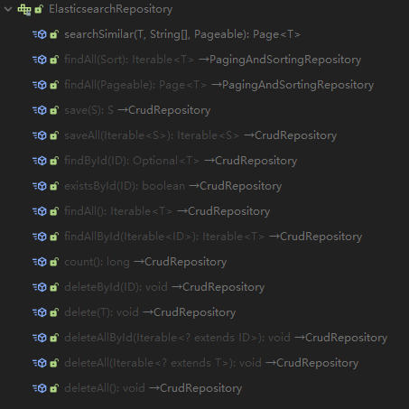
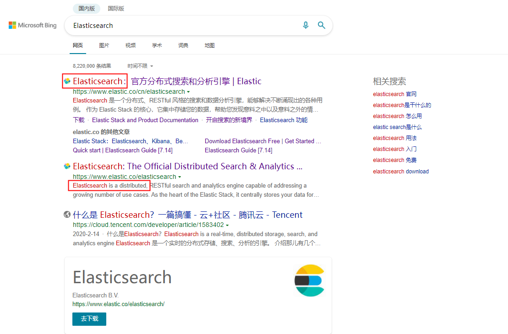

# SpringBoot整合Elasticsearch

## 1 前言

阅读本篇文章您可以了解到如下内容:

- [Spring Boot使用Spring Data Elasticsearch集成Elasticsearch](#2 Spring Boot使用Spring Data Elasticsearch集成Elasticsearch)
- [索引内容的增删改查](#3 索引内容的增删改查)
- [全文检索(排序/高亮)](#4 全文检索)
- [建议器的使用(自动补齐)](#5 建议器)

在此之前, 如果您熟悉以下内容可更方便的进行理解:

- Spring Boot项目构建
- JPA
- 搜索引擎相关概念与功能

项目技术栈与版本:

- Maven: 3.6.3
- Spring Boot: 2.6.3
- Spring Data Elasticsearch: 4.3.1
- Elasticsearch: 7.15.2

## 2 Spring Boot使用Spring Data Elasticsearch集成Elasticsearch

### 2.1 引入依赖

创建Spring Boot项目后, 在pom.xml文件中引入如下依赖:

```xml
<dependency>
    <groupId>org.springframework.boot</groupId>
    <artifactId>spring-boot-starter-data-elasticsearch</artifactId>
</dependency>
```

不用书写version标签, 会自动根据Spring Boot版本号选择

### 2.2 配置文件

在配置文件application.yml中增加如下配置:

```yaml
elasticsearch:
    uris:
      - http://127.0.0.1:9200
```

注意`uris`类型为是字符串数组

## 3 索引内容的增删改查

### 3.1 创建实体类

假设我们需要查询的内容为文章, 其内容包括: 标题/作者/正文/创建时间

可以创建如下实体类:

```java
@Document(indexName = "articles")
@Data
@NoArgsConstructor
public class Article {

    @Id
    private String id;
    @Field
    private String title;
    @Field
    private String author;
    @Field
    private String content;
    @Field
    private Date createTime;
}
```

`@Document`注解的作用是标明此类为保存在Elasticsearch的对象, 其中比较重要的两个参数是**索引名称`indexName`**和**是否自动创建索引`createIndex`**

**注意: `createIndex`的默认值为`true`**

### 3.2 创建存储库类

完成实体类的创建后, 和JPA类似, 需要创建存储库类

Spring Data Elasticsearch提供了`ElasticsearchRepository`, 包含了如下图所示的一些常用查询方法:



```java
public interface ArticleRepository extends ElasticsearchRepository<ArticleEntity, String> {

}
```

如果现有方法不足以支撑业务, 可以根据需求进行自定义, 具体自定义方式可参考[官方文档](https://docs.spring.io/spring-data/elasticsearch/docs/current/reference/html/#elasticsearch.query-methods)

### 3.3 创建服务类

基于上一小节中创建的存储库类, 创建服务类:

```java
@Component
@RequiredArgsConstructor
public class ArticleService {

    private final ArticleRepository articleRepository;

    public Page<Article> list(Pageable pageable) {
        return articleRepository.findAll(pageable);
    }

    public Article loadById(String id) {
        return articleRepository.findById(id).orElse(null);
    }

    public Article add(Article article) {
        article.setCreateTime(new Date());
        return articleRepository.save(article);
    }

    public void updateById(String id, Article article) {
        Optional<Article> optionalDatabaseObject = articleRepository.findById(id);
        if (!optionalDatabaseObject.isPresent()) {
            throw new RuntimeException("数据不存在");
        }
        Article databaseObject = optionalDatabaseObject.get();
        BeanUtil.copyProperties(article, databaseObject, true);
        articleRepository.save(databaseObject);
    }

    public void deleteById(String id) {
        articleRepository.deleteById(id);
    }
}
```

### 3.4 创建接口

基于服务类创建REST接口:

```java
@RestController
@RequestMapping("articles")
@RequiredArgsConstructor
public class ArticleApi {

    private final ArticleService articleService;

    @GetMapping
    public Page<Article> list(Pageable pageable) {
        return articleService.list(pageable);
    }

    @GetMapping("{id}")
    public Article load(@PathVariable("id") String id) {
        return articleService.loadById(id);
    }

    @PostMapping
    public Article add(@RequestBody Article article) {
        articleService.add(article);
        return article;
    }

    @PutMapping("{id}")
    public String update(@PathVariable("id") String id, @RequestBody Article article) {
        articleService.updateById(id, article);
        return "更新成功";
    }

    @DeleteMapping("{id}")
    public String delete(@PathVariable("id") String id) {
        articleService.deleteById(id);
        return "删除成功";
    }
}
```

### 3.5 测试

如果使用IDEA编辑器, 可以使用下面的http文件进行测试:

```
### 查询
GET http://localhost:9999/articles
Content-Type: application/json

### 根据id查看
GET http://localhost:9999/articles/1
Content-Type: application/json

### 新增文章
POST http://localhost:9999/articles
Content-Type: application/json

{
  "id": "1",
  "title": "测试1",
  "author": "测试1",
  "content": "测试1"
}

### 更新文章
PUT http://localhost:9999/articles/1
Content-Type: application/json

{
  "title": "测试1-更新",
  "author": "测试1-更新",
  "content": "测试1-更新"
}

### 删除文章
DELETE http://localhost:9999/articles/1
Content-Type: application/json
```

## 4 全文检索

### 4.1 全文检索方法

假设全文检索的业务需求, 要对文章的标题/作者/正文进行查询, 第三章中的方法无法满足

修改存储库类, 增加全文检索方法:

```java
public interface ArticleRepository extends ElasticsearchRepository<Article, String> {

    Page<Article> findByTitleOrAuthorOrContent(String title, String author, String content, Pageable pageable);
}
```

修改服务类:

```java
@Component
@RequiredArgsConstructor
public class ArticleService {

    private final ArticleRepository articleRepository;

    // 增删改查方法...

    public Page<Article> search(String key, Pageable pageable) {
        return articleRepository.findByTitleOrAuthorOrContent(key, key, key, pageable);
    }
}
```

增加全文检索接口:

```java
@RestController
@RequestMapping("articles")
@RequiredArgsConstructor
public class ArticleApi {

    private final ArticleService articleService;

    // 增删改查接口...

    @GetMapping("search/{key}")
    public Page<Article> search(@PathVariable("key") String key, Pageable pageable) {
        return articleService.search(key, pageable);
    }
}
```

录入测试数据后, 利用http文件进行测试:

```
### 全文检索
GET http://localhost:9999/articles/search/2月
Content-Type: application/json
```

得到测试结果:

```json
{
  "content": [
    {
      "id": "1",
      "title": "2022年2月14日外交部发言人汪文斌主持例行记者会",
      "author": "中华人民共和国外交部",
      "content": "新华社记者：今天是中国和墨西哥建交50周年纪念日，中方如何评价过去50年的中墨关系？今天将有哪些庆祝活动？新华社记者：今天是中国和墨西哥建交50周年纪念日，中方如何评价过去50年的中墨关系？今天将有哪些庆祝活动？为纪念这一双边关系发展的重要里程碑，今天，王毅国务委员兼外长与埃布拉德外长分别在对方国家主流媒体上发表署名文章。中墨两国邮政联合发行《中墨建交五十周年》纪念邮票并举行首发仪式。两国15对具有代表性的友好省州和城市还将在地标建筑隆重举行国旗色亮灯仪式或灯光秀，共同庆祝中墨建交50周年，敬请大家期待。",
      "createTime": 1644915609088
    },
    {
      "id": "3",
      "title": "16年等待，空中技巧“王牌之师”再夺冬奥冠军",
      "author": "新华网",
      "content": "新华社河北崇礼2月14日电　题：16年等待，空中技巧“王牌之师”再夺冬奥冠军新华社河北崇礼2月14日电　题：16年等待，空中技巧“王牌之师”再夺冬奥冠军4天前，张家口云顶滑雪公园，31岁的徐梦桃在北京冬奥会新增项目——自由式滑雪空中技巧混合团体决赛中，和队友贾宗洋、齐广璞携手拿下银牌。对于这块银牌，徐梦桃心有不甘。“后面的个人赛见吧，我将会突出重围，为中国空中技巧争夺荣誉。”赛后，徐梦桃的话铿锵有力。",
      "createTime": 1644915729196
    },
    {
      "id": "2",
      "title": "水庆霞称希望有个一百平米的房子 自曝脾气暴躁",
      "author": "央视新闻",
      "content": "2月6日，农历新年初六，中国女足时隔16年再次问鼎亚洲杯，这场胜利为她们的亚洲杯之旅画上完美的句号，更成为全体国民收到的最好的节日礼物。三天后，《面对面》栏目和正在进行医学隔离的中国女足国家队主教练水庆霞进行了连线专访。记者：去年11月18日对外宣布您担任主教练之前，您就曾经表达过，如果有可能，我愿意做中国女足的教练，为什么？水庆霞：从事这么多年的女足工作，从运动员到教练员我觉得女足的情怀始终扎根在心中，我觉得有机会的话要尝试一下吧。对水庆霞的上任，亚足联官网给出这样的评价：她曾经11年5次举起亚洲杯，是首位出任国家队主教练的黄金一代球员，她比任何人都更懂得如何赢得女足亚洲杯。但当时，留给新任主教练准备出征的时间已经不足三个月。",
      "createTime": 1644915672785
    }
  ],
  "pageable": {
    "sort": {
      "empty": true,
      "sorted": false,
      "unsorted": true
    },
    "offset": 0,
    "pageSize": 50,
    "pageNumber": 0,
    "unpaged": false,
    "paged": true
  },
  "totalElements": 3,
  "last": true,
  "totalPages": 1,
  "number": 0,
  "size": 50,
  "sort": {
    "empty": true,
    "sorted": false,
    "unsorted": true
  },
  "numberOfElements": 3,
  "first": true,
  "empty": false
}
```

### 4.2 高亮

观察上一节的测试结果, 再观察常用的搜索引擎结果:



两者对比存在两个较为明显的差异:

1. 测试结果中没有对匹配内容进行高亮
2. 测试结果中返回了文章正文的全部内容, 而非匹配内容的截取

使用注解`@Highlight`修改存储库中的全文检索方法可以解决上述问题:

```java
public interface ArticleRepository extends ElasticsearchRepository<Article, String> {

    @Highlight(fields = {
            @HighlightField(name = "title"),
            @HighlightField(name = "author"),
            @HighlightField(name = "content"),
    })
    SearchPage<Article> findByTitleOrAuthorOrContent(String title, String author, String content, Pageable pageable);
}
```

注意, 除了增加注解外, **方法的返回结构也需要修改为`SearchPage<T>`**, `Page<T>`的结构中不包含高亮数据

依次调整服务类/接口类, 再次进行测试得到的结果如下:

```json
{
  "content": [
    {
      "index": "articles",
      "id": "1",
      "score": 1.0043064,
      "content": {
        "id": "1",
        "title": "2022年2月14日外交部发言人汪文斌主持例行记者会",
        "author": "中华人民共和国外交部",
        "content": "新华社记者：今天是中国和墨西哥建交50周年纪念日，中方如何评价过去50年的中墨关系？今天将有哪些庆祝活动？新华社记者：今天是中国和墨西哥建交50周年纪念日，中方如何评价过去50年的中墨关系？今天将有哪些庆祝活动？为纪念这一双边关系发展的重要里程碑，今天，王毅国务委员兼外长与埃布拉德外长分别在对方国家主流媒体上发表署名文章。中墨两国邮政联合发行《中墨建交五十周年》纪念邮票并举行首发仪式。两国15对具有代表性的友好省州和城市还将在地标建筑隆重举行国旗色亮灯仪式或灯光秀，共同庆祝中墨建交50周年，敬请大家期待。",
        "createTime": 1644915609088
      },
      "highlightFields": {
        "title": [
          "2022年<em>2月</em>14日外交部发言人汪文斌主持例行记者会"
        ]
      }
    },
    {
      "index": "articles",
      "id": "3",
      "score": 0.69008076,
      "content": {
        "id": "3",
        "title": "16年等待，空中技巧“王牌之师”再夺冬奥冠军",
        "author": "新华网",
        "content": "新华社河北崇礼2月14日电　题：16年等待，空中技巧“王牌之师”再夺冬奥冠军新华社河北崇礼2月14日电　题：16年等待，空中技巧“王牌之师”再夺冬奥冠军4天前，张家口云顶滑雪公园，31岁的徐梦桃在北京冬奥会新增项目——自由式滑雪空中技巧混合团体决赛中，和队友贾宗洋、齐广璞携手拿下银牌。对于这块银牌，徐梦桃心有不甘。“后面的个人赛见吧，我将会突出重围，为中国空中技巧争夺荣誉。”赛后，徐梦桃的话铿锵有力。",
        "createTime": 1644915729196
      },
      "highlightFields": {
        "content": [
          "新华社河北崇礼<em>2月</em>14日电　题：16年等待，空中技巧“王牌之师”再夺冬奥冠军新华社河北崇礼<em>2月</em>14日电　题：16年等待，空中技巧“王牌之师”再夺冬奥冠军4天前，张家口云顶滑雪公园，31岁的徐梦桃在北京冬奥会新增项目"
        ]
      }
    },
    {
      "index": "articles",
      "id": "2",
      "score": 0.43025833,
      "content": {
        "id": "2",
        "title": "水庆霞称希望有个一百平米的房子 自曝脾气暴躁",
        "author": "央视新闻",
        "content": "2月6日，农历新年初六，中国女足时隔16年再次问鼎亚洲杯，这场胜利为她们的亚洲杯之旅画上完美的句号，更成为全体国民收到的最好的节日礼物。三天后，《面对面》栏目和正在进行医学隔离的中国女足国家队主教练水庆霞进行了连线专访。记者：去年11月18日对外宣布您担任主教练之前，您就曾经表达过，如果有可能，我愿意做中国女足的教练，为什么？水庆霞：从事这么多年的女足工作，从运动员到教练员我觉得女足的情怀始终扎根在心中，我觉得有机会的话要尝试一下吧。对水庆霞的上任，亚足联官网给出这样的评价：她曾经11年5次举起亚洲杯，是首位出任国家队主教练的黄金一代球员，她比任何人都更懂得如何赢得女足亚洲杯。但当时，留给新任主教练准备出征的时间已经不足三个月。",
        "createTime": 1644915672785
      },
      "highlightFields": {
        "content": [
          "<em>2月</em>6日，农历新年初六，中国女足时隔16年再次问鼎亚洲杯，这场胜利为她们的亚洲杯之旅画上完美的句号，更成为全体国民收到的最好的节日礼物。"
        ]
      }
    }
  ],
  "pageable": {
    "sort": {
      "empty": true,
      "sorted": false,
      "unsorted": true
    },
    "offset": 0,
    "pageNumber": 0,
    "pageSize": 50,
    "paged": true,
    "unpaged": false
  },
  "searchHits": {
    "totalHits": 3,
    "totalHitsRelation": "EQUAL_TO",
    "maxScore": 1.0043064,
    "searchHits": [
      {
        "index": "articles",
        "id": "1",
        "score": 1.0043064,
        "content": {
          "id": "1",
          "title": "2022年2月14日外交部发言人汪文斌主持例行记者会",
          "author": "中华人民共和国外交部",
          "content": "新华社记者：今天是中国和墨西哥建交50周年纪念日，中方如何评价过去50年的中墨关系？今天将有哪些庆祝活动？新华社记者：今天是中国和墨西哥建交50周年纪念日，中方如何评价过去50年的中墨关系？今天将有哪些庆祝活动？为纪念这一双边关系发展的重要里程碑，今天，王毅国务委员兼外长与埃布拉德外长分别在对方国家主流媒体上发表署名文章。中墨两国邮政联合发行《中墨建交五十周年》纪念邮票并举行首发仪式。两国15对具有代表性的友好省州和城市还将在地标建筑隆重举行国旗色亮灯仪式或灯光秀，共同庆祝中墨建交50周年，敬请大家期待。",
          "createTime": 1644915609088
        },
        "highlightFields": {
          "title": [
            "2022年<em>2月</em>14日外交部发言人汪文斌主持例行记者会"
          ]
        }
      },
      {
        "index": "articles",
        "id": "3",
        "score": 0.69008076,
        "content": {
          "id": "3",
          "title": "16年等待，空中技巧“王牌之师”再夺冬奥冠军",
          "author": "新华网",
          "content": "新华社河北崇礼2月14日电　题：16年等待，空中技巧“王牌之师”再夺冬奥冠军新华社河北崇礼2月14日电　题：16年等待，空中技巧“王牌之师”再夺冬奥冠军4天前，张家口云顶滑雪公园，31岁的徐梦桃在北京冬奥会新增项目——自由式滑雪空中技巧混合团体决赛中，和队友贾宗洋、齐广璞携手拿下银牌。对于这块银牌，徐梦桃心有不甘。“后面的个人赛见吧，我将会突出重围，为中国空中技巧争夺荣誉。”赛后，徐梦桃的话铿锵有力。",
          "createTime": 1644915729196
        },
        "highlightFields": {
          "content": [
            "新华社河北崇礼<em>2月</em>14日电　题：16年等待，空中技巧“王牌之师”再夺冬奥冠军新华社河北崇礼<em>2月</em>14日电　题：16年等待，空中技巧“王牌之师”再夺冬奥冠军4天前，张家口云顶滑雪公园，31岁的徐梦桃在北京冬奥会新增项目"
          ]
        }
      },
      {
        "index": "articles",
        "id": "2",
        "score": 0.43025833,
        "content": {
          "id": "2",
          "title": "水庆霞称希望有个一百平米的房子 自曝脾气暴躁",
          "author": "央视新闻",
          "content": "2月6日，农历新年初六，中国女足时隔16年再次问鼎亚洲杯，这场胜利为她们的亚洲杯之旅画上完美的句号，更成为全体国民收到的最好的节日礼物。三天后，《面对面》栏目和正在进行医学隔离的中国女足国家队主教练水庆霞进行了连线专访。记者：去年11月18日对外宣布您担任主教练之前，您就曾经表达过，如果有可能，我愿意做中国女足的教练，为什么？水庆霞：从事这么多年的女足工作，从运动员到教练员我觉得女足的情怀始终扎根在心中，我觉得有机会的话要尝试一下吧。对水庆霞的上任，亚足联官网给出这样的评价：她曾经11年5次举起亚洲杯，是首位出任国家队主教练的黄金一代球员，她比任何人都更懂得如何赢得女足亚洲杯。但当时，留给新任主教练准备出征的时间已经不足三个月。",
          "createTime": 1644915672785
        },
        "highlightFields": {
          "content": [
            "<em>2月</em>6日，农历新年初六，中国女足时隔16年再次问鼎亚洲杯，这场胜利为她们的亚洲杯之旅画上完美的句号，更成为全体国民收到的最好的节日礼物。"
          ]
        }
      }
    ],
    "empty": false
  },
  "totalElements": 3,
  "totalPages": 1,
  "number": 0,
  "size": 50,
  "sort": {
    "empty": true,
    "sorted": false,
    "unsorted": true
  },
  "numberOfElements": 3,
  "first": true,
  "last": true,
  "empty": false
}
```

其中`highlightFields`属性中的内容即为所需内容, 且对正文内容进行了截取, 只显示匹配部分

### 4.3 排序

观察上一小节的测试结果, 可以发现默认排序字段是`score`

使用Spring Data分页查询, 可以通过如下方式实现自定义排序:

```
### 搜索并自定义排序
GET http://localhost:9999/articles/search/2月?sort=score,desc
Content-Type: application/json
```

执行请求后, 会发现直接抛出异常`No mapping found for [score] in order to sort`

这里有个小坑, 需要提前阅读[Elasticsearch排序相关文档](https://www.elastic.co/guide/en/elasticsearch/reference/7.15/sort-search-results.html)

在Elasticsearch中, 排序字段名称为`_score`, 并非刚才说的`score`

再次修改请求, 并加入按创建时间倒序的自定义排序:

```
### 搜索并自定义排序
GET http://localhost:9999/articles/search/2月?sort=_score,desc&sort=createTime,desc
Content-Type: application/json
```

测试结果:

```json
{
  "content": [
    {
      "index": "articles",
      "id": "1",
      "score": 1.0043064,
      "sortValues": [
        1.0043064,
        1644915609088,
        1.0043064,
        1644915609088
      ],
      "content": {
        "id": "1",
        "title": "2022年2月14日外交部发言人汪文斌主持例行记者会",
        "author": "中华人民共和国外交部",
        "content": "新华社记者：今天是中国和墨西哥建交50周年纪念日，中方如何评价过去50年的中墨关系？今天将有哪些庆祝活动？新华社记者：今天是中国和墨西哥建交50周年纪念日，中方如何评价过去50年的中墨关系？今天将有哪些庆祝活动？为纪念这一双边关系发展的重要里程碑，今天，王毅国务委员兼外长与埃布拉德外长分别在对方国家主流媒体上发表署名文章。中墨两国邮政联合发行《中墨建交五十周年》纪念邮票并举行首发仪式。两国15对具有代表性的友好省州和城市还将在地标建筑隆重举行国旗色亮灯仪式或灯光秀，共同庆祝中墨建交50周年，敬请大家期待。",
        "createTime": 1644915609088
      },
      "highlightFields": {
        "title": [
          "2022年<em>2月</em>14日外交部发言人汪文斌主持例行记者会"
        ]
      }
    },
    {
      "index": "articles",
      "id": "3",
      "score": 0.69008076,
      "sortValues": [
        0.69008076,
        1644915729196,
        0.69008076,
        1644915729196
      ],
      "content": {
        "id": "3",
        "title": "16年等待，空中技巧“王牌之师”再夺冬奥冠军",
        "author": "新华网",
        "content": "新华社河北崇礼2月14日电　题：16年等待，空中技巧“王牌之师”再夺冬奥冠军新华社河北崇礼2月14日电　题：16年等待，空中技巧“王牌之师”再夺冬奥冠军4天前，张家口云顶滑雪公园，31岁的徐梦桃在北京冬奥会新增项目——自由式滑雪空中技巧混合团体决赛中，和队友贾宗洋、齐广璞携手拿下银牌。对于这块银牌，徐梦桃心有不甘。“后面的个人赛见吧，我将会突出重围，为中国空中技巧争夺荣誉。”赛后，徐梦桃的话铿锵有力。",
        "createTime": 1644915729196
      },
      "highlightFields": {
        "content": [
          "新华社河北崇礼<em>2月</em>14日电　题：16年等待，空中技巧“王牌之师”再夺冬奥冠军新华社河北崇礼<em>2月</em>14日电　题：16年等待，空中技巧“王牌之师”再夺冬奥冠军4天前，张家口云顶滑雪公园，31岁的徐梦桃在北京冬奥会新增项目"
        ]
      }
    },
    {
      "index": "articles",
      "id": "2",
      "score": 0.43025833,
      "sortValues": [
        0.43025833,
        1644915672785,
        0.43025833,
        1644915672785
      ],
      "content": {
        "id": "2",
        "title": "水庆霞称希望有个一百平米的房子 自曝脾气暴躁",
        "author": "央视新闻",
        "content": "2月6日，农历新年初六，中国女足时隔16年再次问鼎亚洲杯，这场胜利为她们的亚洲杯之旅画上完美的句号，更成为全体国民收到的最好的节日礼物。三天后，《面对面》栏目和正在进行医学隔离的中国女足国家队主教练水庆霞进行了连线专访。记者：去年11月18日对外宣布您担任主教练之前，您就曾经表达过，如果有可能，我愿意做中国女足的教练，为什么？水庆霞：从事这么多年的女足工作，从运动员到教练员我觉得女足的情怀始终扎根在心中，我觉得有机会的话要尝试一下吧。对水庆霞的上任，亚足联官网给出这样的评价：她曾经11年5次举起亚洲杯，是首位出任国家队主教练的黄金一代球员，她比任何人都更懂得如何赢得女足亚洲杯。但当时，留给新任主教练准备出征的时间已经不足三个月。",
        "createTime": 1644915672785
      },
      "highlightFields": {
        "content": [
          "<em>2月</em>6日，农历新年初六，中国女足时隔16年再次问鼎亚洲杯，这场胜利为她们的亚洲杯之旅画上完美的句号，更成为全体国民收到的最好的节日礼物。"
        ]
      }
    }
  ],
  "pageable": {
    "sort": {
      "empty": false,
      "sorted": true,
      "unsorted": false
    },
    "offset": 0,
    "pageNumber": 0,
    "pageSize": 50,
    "paged": true,
    "unpaged": false
  },
  "searchHits": {
    "totalHits": 3,
    "totalHitsRelation": "EQUAL_TO",
    "maxScore": "NaN",
    "searchHits": [
      {
        "index": "articles",
        "id": "1",
        "score": 1.0043064,
        "sortValues": [
          1.0043064,
          1644915609088,
          1.0043064,
          1644915609088
        ],
        "content": {
          "id": "1",
          "title": "2022年2月14日外交部发言人汪文斌主持例行记者会",
          "author": "中华人民共和国外交部",
          "content": "新华社记者：今天是中国和墨西哥建交50周年纪念日，中方如何评价过去50年的中墨关系？今天将有哪些庆祝活动？新华社记者：今天是中国和墨西哥建交50周年纪念日，中方如何评价过去50年的中墨关系？今天将有哪些庆祝活动？为纪念这一双边关系发展的重要里程碑，今天，王毅国务委员兼外长与埃布拉德外长分别在对方国家主流媒体上发表署名文章。中墨两国邮政联合发行《中墨建交五十周年》纪念邮票并举行首发仪式。两国15对具有代表性的友好省州和城市还将在地标建筑隆重举行国旗色亮灯仪式或灯光秀，共同庆祝中墨建交50周年，敬请大家期待。",
          "createTime": 1644915609088
        },
        "highlightFields": {
          "title": [
            "2022年<em>2月</em>14日外交部发言人汪文斌主持例行记者会"
          ]
        }
      },
      {
        "index": "articles",
        "id": "3",
        "score": 0.69008076,
        "sortValues": [
          0.69008076,
          1644915729196,
          0.69008076,
          1644915729196
        ],
        "content": {
          "id": "3",
          "title": "16年等待，空中技巧“王牌之师”再夺冬奥冠军",
          "author": "新华网",
          "content": "新华社河北崇礼2月14日电　题：16年等待，空中技巧“王牌之师”再夺冬奥冠军新华社河北崇礼2月14日电　题：16年等待，空中技巧“王牌之师”再夺冬奥冠军4天前，张家口云顶滑雪公园，31岁的徐梦桃在北京冬奥会新增项目——自由式滑雪空中技巧混合团体决赛中，和队友贾宗洋、齐广璞携手拿下银牌。对于这块银牌，徐梦桃心有不甘。“后面的个人赛见吧，我将会突出重围，为中国空中技巧争夺荣誉。”赛后，徐梦桃的话铿锵有力。",
          "createTime": 1644915729196
        },
        "highlightFields": {
          "content": [
            "新华社河北崇礼<em>2月</em>14日电　题：16年等待，空中技巧“王牌之师”再夺冬奥冠军新华社河北崇礼<em>2月</em>14日电　题：16年等待，空中技巧“王牌之师”再夺冬奥冠军4天前，张家口云顶滑雪公园，31岁的徐梦桃在北京冬奥会新增项目"
          ]
        }
      },
      {
        "index": "articles",
        "id": "2",
        "score": 0.43025833,
        "sortValues": [
          0.43025833,
          1644915672785,
          0.43025833,
          1644915672785
        ],
        "content": {
          "id": "2",
          "title": "水庆霞称希望有个一百平米的房子 自曝脾气暴躁",
          "author": "央视新闻",
          "content": "2月6日，农历新年初六，中国女足时隔16年再次问鼎亚洲杯，这场胜利为她们的亚洲杯之旅画上完美的句号，更成为全体国民收到的最好的节日礼物。三天后，《面对面》栏目和正在进行医学隔离的中国女足国家队主教练水庆霞进行了连线专访。记者：去年11月18日对外宣布您担任主教练之前，您就曾经表达过，如果有可能，我愿意做中国女足的教练，为什么？水庆霞：从事这么多年的女足工作，从运动员到教练员我觉得女足的情怀始终扎根在心中，我觉得有机会的话要尝试一下吧。对水庆霞的上任，亚足联官网给出这样的评价：她曾经11年5次举起亚洲杯，是首位出任国家队主教练的黄金一代球员，她比任何人都更懂得如何赢得女足亚洲杯。但当时，留给新任主教练准备出征的时间已经不足三个月。",
          "createTime": 1644915672785
        },
        "highlightFields": {
          "content": [
            "<em>2月</em>6日，农历新年初六，中国女足时隔16年再次问鼎亚洲杯，这场胜利为她们的亚洲杯之旅画上完美的句号，更成为全体国民收到的最好的节日礼物。"
          ]
        }
      }
    ],
    "empty": false
  },
  "totalElements": 3,
  "totalPages": 1,
  "number": 0,
  "size": 50,
  "sort": {
    "empty": false,
    "sorted": true,
    "unsorted": false
  },
  "numberOfElements": 3,
  "first": true,
  "last": true,
  "empty": false
}
```

结果中新增了一个属性`sortValues`, 正是根据它对数据进行的排序

### 4.4 中文分词器

Elasticsearch提供了分析的REST接口, 先来观察下英文的分词结果:

```
GET http://10.10.10.127:9200/_analyze
Content-Type: application/json

{
  "text" : "China No.1"
}
```

```json
{
  "tokens": [
    {
      "token": "china",
      "start_offset": 0,
      "end_offset": 5,
      "type": "<ALPHANUM>",
      "position": 0
    },
    {
      "token": "no",
      "start_offset": 6,
      "end_offset": 8,
      "type": "<ALPHANUM>",
      "position": 1
    },
    {
      "token": "1",
      "start_offset": 9,
      "end_offset": 10,
      "type": "<NUM>",
      "position": 2
    }
  ]
}
```

结果为china/no/1, 相当正确

再来看看中文的:

```
### 分析
GET http://10.10.10.127:9200/_analyze
Content-Type: application/json

{
  "text" : "中国第一"
}
```

```json
{
  "tokens": [
    {
      "token": "中",
      "start_offset": 0,
      "end_offset": 1,
      "type": "<IDEOGRAPHIC>",
      "position": 0
    },
    {
      "token": "国",
      "start_offset": 1,
      "end_offset": 2,
      "type": "<IDEOGRAPHIC>",
      "position": 1
    },
    {
      "token": "第",
      "start_offset": 2,
      "end_offset": 3,
      "type": "<IDEOGRAPHIC>",
      "position": 2
    },
    {
      "token": "一",
      "start_offset": 3,
      "end_offset": 4,
      "type": "<IDEOGRAPHIC>",
      "position": 3
    }
  ]
}
```

竟然一个字一个字的拆分, 这着实有点蠢了, 会出现各种奇葩造句中的搜索结果, 例如**过节**和**杨过节后骑着雕上班**

所以, 选择一个合适的中文分词器至关重要

在对比过几个中文分词器后, 笔者认为只有一个最佳选择, 那就是[IK分词器](https://github.com/medcl/elasticsearch-analysis-ik)

原因有如下两点:

1. 超高的star数量代表着繁荣的生态
2. 支持在线热更新字典

对于IK分词器不再进行过多讲述, 看一下它的中文分词结果:

ik_smart:

```
### 分析
GET http://10.10.10.127:9200/_analyze
Content-Type: application/json

{
  "analyzer" : "ik_smart",
  "text" : "中国第一"
}
```

```json
{
  "tokens": [
    {
      "token": "中国",
      "start_offset": 0,
      "end_offset": 2,
      "type": "CN_WORD",
      "position": 0
    },
    {
      "token": "第一",
      "start_offset": 2,
      "end_offset": 4,
      "type": "CN_WORD",
      "position": 1
    }
  ]
}
```

ik_max_word:

```
### 分析
GET http://10.10.10.127:9200/_analyze
Content-Type: application/json

{
  "analyzer" : "ik_max_word",
  "text" : "中国第一"
}
```

```json
{
  "tokens": [
    {
      "token": "中国",
      "start_offset": 0,
      "end_offset": 2,
      "type": "CN_WORD",
      "position": 0
    },
    {
      "token": "第一",
      "start_offset": 2,
      "end_offset": 4,
      "type": "CN_WORD",
      "position": 1
    },
    {
      "token": "一",
      "start_offset": 3,
      "end_offset": 4,
      "type": "TYPE_CNUM",
      "position": 2
    }
  ]
}
```

分词效果不用说, 高下立判

确定中文分词器后, 需要配置索引默认分词器为IK:

在resource下创建elasticsearch/settings/default.json:

```json
{
  "analysis": {
    "analyzer": {
      "default": {
        "tokenizer": "ik_smart"
      }
    }
  }
}
```

修改文章实体类, 增加注解`@Setting`:

```java
@Document(indexName = "articles")
@Setting(settingPath = "elasticsearch/settings/default.json")
@Data
@NoArgsConstructor
public class Article {

    @Id
    private String id;
    @Field
    private String title;
    @Field
    private String author;
    @Field
    private String content;
    @Field
    private Date createTime;
}
```

## 5 建议器

### 5.1 补齐建议器

自动补齐的实现有很多种, 笔者接触的业务逻辑专业性较强且较为简单, 所以本节的内容仅作参考

描述下业务场景:

1. 自动补齐内容为热门搜索词汇
2. 每天产生的搜索词数量极少, 在100-200之间
3. 已配备运维人员, 会人工干预参与搜索词的权重调整

针对上述场景, 决定实现方式为:

1. 每天定时将搜索词全量刷新至Elasticsearch热词索引库
2. 用户输入时利用补齐建议器查询结果

创建热门搜索词汇实体类:

```java
@Document(indexName = "trending")
@Setting(settingPath = "elasticsearch/settings/default.json")
@Data
@NoArgsConstructor
@FieldNameConstants
public class Trending {

    @Id
    private String id;
    @CompletionField
    private Completion suggest;
}
```

使用注解`@CompletionField`标注补齐字段, 且类型为`Completion`

**注意, 在这里存在小坑**

使用Jackson进行json格式转换, 此时的`Completion`类并没有无参数构造函数, 提交接口会抛出异常

所以需要创建一个继承类`JsonCompletion`对其进行处理:

```java
public class JsonCompletion extends Completion {

    public JsonCompletion() {
        super(new String[0]);
    }
}
```

建议器的查询不能使用`ElasticsearchRepository`

需要在服务层利用`CompletionSuggestionBuilder`和`ElasticsearchRestTemplate`:

```java
@Component
@RequiredArgsConstructor
public class TrendingService {

    private final ElasticsearchRestTemplate elasticsearchRestTemplate;

    public List<String> suggest(String text) {
        List<String> result = new ArrayList<>();
        CompletionSuggestionBuilder builder = SuggestBuilders.completionSuggestion(Trending.Fields.suggest)
                .prefix(text).size(10).skipDuplicates(true);
        SuggestBuilder suggestBuilder = new SuggestBuilder();
        suggestBuilder.addSuggestion("trending-suggest", builder);
        CompletionSuggestion suggest = elasticsearchRestTemplate.suggest(suggestBuilder,
                        elasticsearchRestTemplate.getIndexCoordinatesFor(Trending.class)).getSuggest()
                .getSuggestion("trending-suggest");
        for (CompletionSuggestion.Entry.Option option : suggest.getOptions()) {
            result.add(option.getText().toString());
        }
        return result;
    }
}
```

网上部分教程使用的是`HashSet<String>`作为返回结果

由于笔者业务需求场景中有权重概念, 返回结果应为有序集, 故选择`List<String>`

创建接口:

```java
@RestController
@RequestMapping("trending")
@RequiredArgsConstructor
public class TrendingApi {

    private final TrendingService trendingService;

    @GetMapping("suggest/{text}")
    public List<String> suggest(@PathVariable("text") String text) {
        return trendingService.suggest(text);
    }
}
```

提前录入一些测试数据:

```json
[
  {
    "id": "1",
    "suggest": {
      "input": ["张三"],
      "weight": 3
    }
  },
  {
    "id": "2",
    "suggest": {
      "input": ["张六"],
      "weight": 6
    }
  },
  {
    "id": "3",
    "suggest": {
      "input": ["张十四"],
      "weight": 14
    }
  },
  {
    "id": "4",
    "suggest": {
      "input": ["张三-法外狂徒"],
      "weight": 999
    }
  }
]
```

调用接口进行测试:

```
### 建议
GET http://localhost:9999/trending/suggest/张
Content-Type: application/json
```

```json
[
  "张三-法外狂徒",
  "张十四",
  "张六",
  "张三"
]
```


