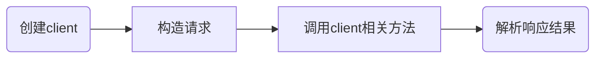

# SpringBoot整合钉钉SDK

## 1 前言

阅读本篇文章您可以了解到如下内容:

- DingTalk SDK
- Spring Boot 整合 Ding Talk SDK

在此之前, 如果您熟悉以下内容可更方便的进行理解:

- DingTalk 官方文档
- 模板方法模式

## 2 DingTalk SDK

身为Java开发者, 能看到钉钉官方提供的SDK还是十分高兴的

钉钉官方服务端接口有两个版本: 旧的和新的

二者的区别可以参考官方文档[钉钉开放文档 (dingtalk.com)](https://open.dingtalk.com/document/orgapp-server/differences-between-server-apis-and-new-server-apis)

简单总结一下:

1. 旧接口不会再发生变动
2. 旧接口**不会支持新API**
3. 新接口会支持新API
4. 新接口**不支持部分旧API**, 未来会全部支持

介于这种情况, 当下我们在开发过程中, **可能需要同时使用新旧两版SDK**

钉钉官方提供了一个很好用的接口工具: [API Explorer (dingtalk.com)](https://open-dev.dingtalk.com/apiExplorer?spm=ding_open_doc.document.0.0.702d722fEcr2Hb#/?devType=org&api=oauth2_1.0%23CreateJsapiTicket)

笔者通过观察发现, 两版SDK的使用方式差别较大, 且需要开发人员手动维护Token

为了更快的方便公司兄弟们上手, 笔者借鉴了模板方法的一点技巧, 简单的对两个SDK进行包装

## 3 Spring Boot 整合 Ding Talk SDK

在pom中引入SDK依赖:

```xml
<dependency>
    <groupId>com.aliyun</groupId>
    <artifactId>alibaba-dingtalk-service-sdk</artifactId>
</dependency>
<dependency>
    <groupId>com.aliyun</groupId>
    <artifactId>dingtalk</artifactId>
</dependency>
```

首先创建钉钉开发所需要的配置参数类`DingTalkProperties`:

```java
@ConfigurationProperties(prefix = "ding-talk")
@Data
public class DingTalkProperties {

  private Long agentId;
  private String appKey;
  private String appSecret;
}
```

创建模板方法类`DingTalkTemplate`:

```java
public class DingTalkTemplate {

  public static final Config NEW_SDK_DEFAULT_CONFIG;
  private final DingTalkProperties properties;

  static {
    Config config = new Config();
    config.protocol = "https";
    config.regionId = "central";
    NEW_SDK_DEFAULT_CONFIG = config;
  }

  public DingTalkTemplate(DingTalkProperties properties) {
    this.properties = properties;
  }
}
```

通过分析官网新版的SDK代码

可以归纳其流程为:



其中所有的client都是`com.aliyun.teaopenapi.Client`的子类

所以我们手动进行管理:

```java
public class DingTalkTemplate {
  // ...其它代码
  private final Map<Class<? extends Client>, Client> newSdkClientMap = new ConcurrentHashMap<>();

  /**
   * 获取新SDK客户端
   *
   * @param clientClass 客户端类型
   * @param <T>         客户类型
   * @return 新SDK客户端
   * @throws NoSuchClientException 未找到客户端异常
   */
  public <T extends Client> T getNewSdkClient(Class<T> clientClass) throws NoSuchClientException {
    T result = (T) newSdkClientMap.get(clientClass);
    if (result == null) {
      try {
        result = clientClass.getConstructor(Config.class).newInstance(NEW_SDK_DEFAULT_CONFIG);
      } catch (Exception e) {
        throw new NoSuchClientException(clientClass);
      }
      newSdkClientMap.put(clientClass, result);
    }
    return result;
  }
}
```

参照官网新版的SDK代码, 我们在内存中对token进行维护:

```java
public class DingTalkTemplate {

  // ...其它代码
  private static final Integer TOKEN_RESERVED_MINUTES = 5;
  private String accessToken;
  private LocalDateTime accessTokenExpirationTime;

  /**
   * 获取accessToken
   *
   * @throws Exception 请求异常
   */
  private void accessToken() throws Exception {
    GetAccessTokenResponseBody body = oauth2AccessToken();
    accessToken = body.getAccessToken();
    accessTokenExpirationTime = LocalDateTime.now().minusMinutes(TOKEN_RESERVED_MINUTES)
      .plusSeconds(body.getExpireIn());
  }

  /**
   * 获取accessToken
   *
   * @return token结果
   * @throws Exception 请求异常
   */
  public GetAccessTokenResponseBody oauth2AccessToken() throws Exception {
    return oauth2AccessToken(properties.getAppKey(), properties.getAppSecret());
  }

  /**
   * 获取accessToken
   *
   * @param appKey    应用key
   * @param appSecret 应用密钥
   * @return token结果
   * @throws Exception 请求异常
   */
  public GetAccessTokenResponseBody oauth2AccessToken(String appKey, String appSecret) throws Exception {
    com.aliyun.dingtalkoauth2_1_0.Client client = getNewSdkClient(com.aliyun.dingtalkoauth2_1_0.Client.class);
    GetAccessTokenRequest getAccessTokenRequest = new GetAccessTokenRequest().setAppKey(appKey).setAppSecret(appSecret);
    return client.getAccessToken(getAccessTokenRequest).getBody();
  }

  /**
   * token是否过期
   *
   * @return true 是 false 否
   */
  private boolean isTokenExpired() {
    return accessToken == null || "".equals(accessToken) || LocalDateTime.now().isAfter(accessTokenExpirationTime);
  }
}
```

观察旧版SDK代码, 其流程与新版相似, 只是创建客户端的姿势不同

我们可以进一步包装:

```java
public class DingTalkTemplate {

  // ...其它代码
  private final Map<String, DingTalkClient> clientMap = new ConcurrentHashMap<>();

  /**
   * 获取请求客户端
   *
   * @param uri 请求资源路径
   * @return 请求客户端
   */
  public DingTalkClient getClient(String uri) {
    return clientMap.computeIfAbsent(uri, DefaultDingTalkClient::new);
  }

  /**
   * 旧版SDK执行请求
   *
   * @param uri     请求资源路径
   * @param request 请求
   * @param <T>     响应结果类型
   * @return 响应结果
   * @throws Exception 请求异常
   */
  public <T extends TaobaoResponse> T execute(String uri, TaobaoRequest<T> request) throws Exception {
    if (isTokenExpired()) {
      accessToken();
    }
    return getClient(uri).execute(request, accessToken);
  }
}
```

## 3 总结

有官方提供的SDK还是很香的

新版SDK更新频率很高(毕竟是低代码自动生成), 在使用时请持续关注
