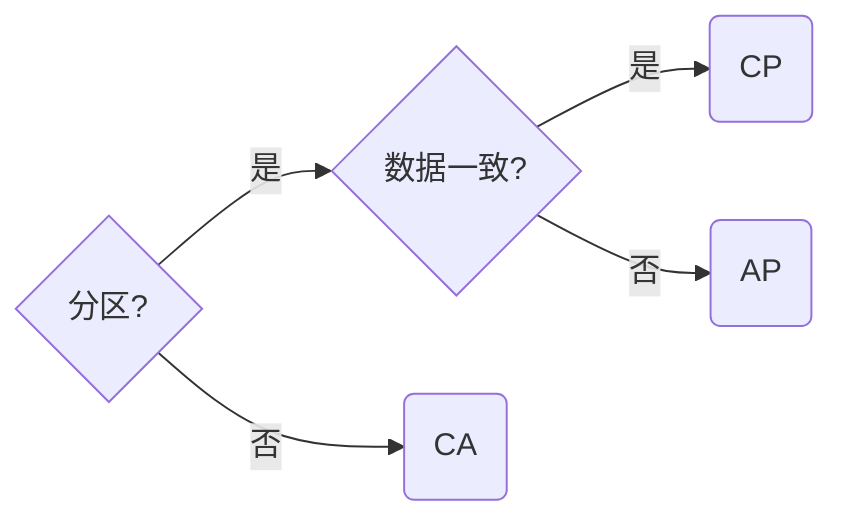

# 微服务

## 什么是微服务

微服务是一种架构, 与单体和集群一样, 是业务系统的一种解决方案

微服务的核心是**分布式**, 与集群有本质的区别

集群内部**所有服务一致**, 重点在负载均衡抗压, 而分布式是将系统的各个服务进行拆分, 内部的**每个服务职责不同**, 负载均衡只是其的一小部分

在使用微服务之前, 应熟悉分布式的理论基础: **CAP**和**BASE**

### CAP

- Consistency: 一致性
- Availability: 可用性
- Partition Tolerance: 分区容错性

在实际业务中该如何考虑实现CAP理论呢?

首先, 我们应判断系统存不存在分区的情况, 如果存在, 则必须要保证P

在保证P的前提下, 当前的技术能力无法实现CA, 只能根据实际的业务场景选择C或A

在不需要保证P的前提下, 可以实现CA, 但不保证P却与分布式的核心冲突

**根据业务需求, 选择CP或AP**

### BASE

- BA(Basically Available): 基本可用
- S(Soft-state): 软状态
- E(Eventually Consistent): 最终一致性

BASE其实是基于CAP理论, 在实际项目中演化出来的, 是AP生产级别的延申和补充

### Raft算法

拜占庭将军衍生出的共识算法, 主要有以下角色:

1. Leader: 领导者
2. Candidate: 候选者
3. Follower: 追随者

在CAP理论中, **Raft算法是CP的实现**, 最经典的实现是ZooKeeper

## 微服务模式下的开发

微服务架构与传统架构从应用场景/思维模式/技术方案上都有着较大的不同

从开发人员角度, 微服务有一个巨大的优点: **可以显著减少技术债务**

微服务是单体架构的升级与拓展, 并不是单体架构的替代

### 如何选择架构

单体架构:

1. 业务稳定
2. 迭代周期长
3. 访问压力小

微服务架构:

1. 大型/复杂项目
2. 频繁迭代
3. 访问压力大

### 微服务开发

应熟悉微服务的主要概念和模块:

1. 服务(资源)
2. 客户端
3. 注册中心
4. 配置中心
5. 网关

在设计中需要注意:

1. 服务职责单一
2. 数据源单一: 理论上对于同一数据源, 只有一个服务进行写入, 其它只能读取
3. 分布式ID
4. 分布式事务

### 微服务优点

1. 服务易于开发/维护
2. 服务启动/运行较快
3. 松耦合: 局部需求变动很容易迭代
4. 无技术栈限制
5. 良好的伸缩性
6. 高性能/高可用
7. 减少技术债务

### 微服务缺点

1. 分布式复杂性
2. 运维成本高
3. 重复劳动
4. 接口调用成本增加: 资源消耗/链路追踪困难

**没有银弹, 任何架构/技术都应服务于需求**

## 技术栈

- Spring Cloud Alibaba/Spring Boot/Vue
- Nacos
- Spring Cloud Gateway
- OpenFeign
- Spring Cloud Sleuth
- Sentinel
- Seata
- Spring Security 5

目前已实现的支撑服务有: **统一身份认证/网关动态路由/网关管理**

### 统一身份认证

提供了注册客户端管理/应用管理/组织机构管理/部门管理/用户管理/角色管理/权限管理功能

并开放应用一级的用户管理/角色管理/权限管理接口

### 网关管理

提供了资源管理/接口管理/路由管理功能

### Spring Boot项目接入

后续会提供相关文档
